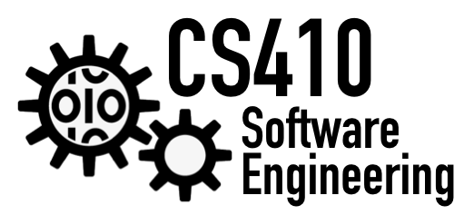
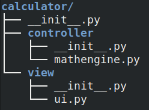

Hands-On Day 1: Environment! 
=============================

Login to the GIBBS compute cluster
----------------------------------

-   We need an SSH client! Mac and Linux come with a client. For
    windows, please install PuTTy, Cygwin, or the WSFL.

-   We probably need a VPN connection: <https://vpn.umb.edu>, download
    client and use `vpn.umb.edu` for the portal address. Here are
    detailed instructions (including Linux):
    <https://www.umb.edu/it/vpn>

-   `ssh UMBusername001@gibbs.umb.edu` or via PuTTy

Setup Conda Environment
-----------------------

### Load Anaconda

-   We will load conda for the GIBBS cluster (or install miniconda on
    your own machine).

-   On GIBBS type: `module load python/anaconda3.7`

-   You type `conda init`—this will modify your `.bashrc` file.

-   To reload the `.bashrc` file, please logout (you can type `exit`)
    and login again.

### Create Environment

-   To create a new environment, type:
    `conda create --name CS410 python=3`

-   Now we activate the new environment: `conda activate CS410`

-   You should see the current active environment at the console prompt
    `(CS410)` instead of `(Base)`.

-   Here is a good cheatsheet for conda:
    <https://cs410.net/notes/conda.pdf>

### Install Jupyter Notebook

-   `conda install jupyter`

### Install GIT 

-   `conda install git`

or load the module

-   `module load git`

Create and Clone Github Repository
----------------------------------

-   Go to github.com and sign in

-   Create new repository `CS410firststeps` and choose initialize with
    README and .gitignore for Python and MIT License

-   click the green button Clone or Download and copy the URL

-   on GIBBS use the url to clone it with this command: `git clone URL`
    (replace the URL with the actual URL)

-   Here is a good cheatsheet for git: <https://cs410.net/notes/git.pdf>
    (I always start with `git status` to get an idea of the local state)

Tmux 
----

-   Tmux allows you to keep a session on the cluster open and supports
    tabs/panes in the terminal.

-   To install `conda install -c conda-forge tmux` 

-   Then run `tmux` and a green bar shows up in the bottom of the
    terminal

-   We need do re-activate our conda environment `conda activate CS410`

-   Here is a useful Tmux Cheatsheet <https://tmuxcheatsheet.com/>

Connect to Compute Node! 
------------------------

-   On GIBBS, we always first connect to the login node `gibbshead`

-   To run code, we need to connect to a compute node with the following
    command
    `srun --pty -t 24:00:00 --export=ALL --ntasks=1 --mem=8000 /bin/bash`
    (this will give us an interactive shell with 8GB Ram for 24 hours), best is to run this command in a tmux window

-   Now we can check the hostname of the compute node with `uname -a`
    (it should not be `gibbshead` anymore but maybe `gibbs02` or some
    other name!)

C++ Session 
-----------

### Create Hello, World Example 

-   Find some C++ example, like this one: <http://cplusplus.org/>

-   Create a new file `vi hello.cc` (any extension is fine)

-   Switch to INSERT vi mode by pressing `i`

-   Paste the code.

-   Press ESCAPE to exit INSERT mode and type the following to write and
    quit `:wq`

### Compile Hello, World 

-   Type `g++ hello.cc` to compile the code. A file `a.out` is
    generated.

-   Type `./a.out` to run the code.

-   You can also do `g++ -o hello hello.cc` to name the compiled
    executable and then run it with `./hello`

Python Session 
--------------

### Configure Jupyter Notebook 

-   `jupyter notebook --generate-config`

-   `vi /home/UMBusername001/.jupyter/jupyter_notebook_config.py`

-   add the following three lines at the bottom of the file:

-   `c.NotebookApp.ip = ’0.0.0.0’`

-   `c.NotebookApp.open_browser = False`

-   `c.NotebookApp.port = YOUR_ASSIGNED_NUMBER`

### Install Matplotlib 

-   `conda install matplotlib`

### Start Jupyter Notebook 

-   In tmux, after activating our conda environment, you can run
    `jupyter notebook` to start the notebook server.

-   But without Tunnel, this is pretty useless.

### Setup Tunnel to Gibbs 

-   We need to tunnel through the `gibbshead` login node to the compute
    node where jupyter notebook is running.

-   You can find the name of the compute node with `uname -a`

-   On your local machine type
    `ssh UMBusername001@gibbs.umb.edu -L YOUR_ASSIGNED_NUMBER:localhost:`\
    `YOUR_ASSIGNED_NUMBER ssh gibbs02.gibbs.local -L YOUR_ASSIGNED_NUMBER:localhost:YOUR_ASSIGNED_NUMBER`
    and, of course, replace `YOUR_ASSIGNED_NUMBER` with the one you used
    above during configuration of jupyter. Also, replace
    `UMBusername001` with your information.

-   For windows users, you need to configure this tunnel via PuTTy
    (Loraine knows how!). See
    <https://blog.devolutions.net/2017/4/how-to-configure-an-ssh-tunnel-on-putty>
    and
    <https://serverfault.com/questions/340865/ssh-tunnel-over-multi-hops-using-putty>

### Mount repo via sshfs

-   Using sshfs allows you to edit your files ‘locally’ and in-sync with
    the cluster directory. For this, we need a local mountpoint and
    create a directory: `mkdir CS410firststeps_cluster`

-   Type `ssh -f UMBusername001@gibbs.umb.edu -L 2233:localhost:22 -N`

-   And then\
    `sshfs -p 2233 UMBusername001@localhost:/home/UMBusername001/Projects/CS410firststeps`\
    ` CS410firststeps_cluster` (replace UMBusername001 with your user
    name).

### Create new Python Notebook 

With the tunnel from above, you can access the jupyter notebook from
your local browser using
[http://localhost:YOUR\_ASSIGNED\_NUMBER](http://localhost:YOUR_ASSIGNED_NUMBER).
You need to copy the token value from the terminal where you run jupyter
notebook on gibbs (just the part after `?token=`). Then, please paste
the token into the browser to login to jupyter notebook. There, you use
the “New” button to create a Python 3
notebook.https://www.overleaf.com/2661352422jbsjhstrqrzw

### Create Python Package Structure 

Packages are a good way of structuring your code. In class, we learned
about the Model-View-Controller (MVC) pattern and created the following
folder structure. **See <https://cs410.net/slides/cs410_lecture9b> for
details and code!**

### Use Autoreload Extension 

In jupyter notebook, we can use the autoreload extension. This extension
allows us to modify code in `.py` files and call the updated code in our
notebook without restarting the kernel. This allows for fast developing.
Warning: if function signatures change, we always need to restart the
kernel!\

`%load_ext autoreload`\
`%autoreload 2`
